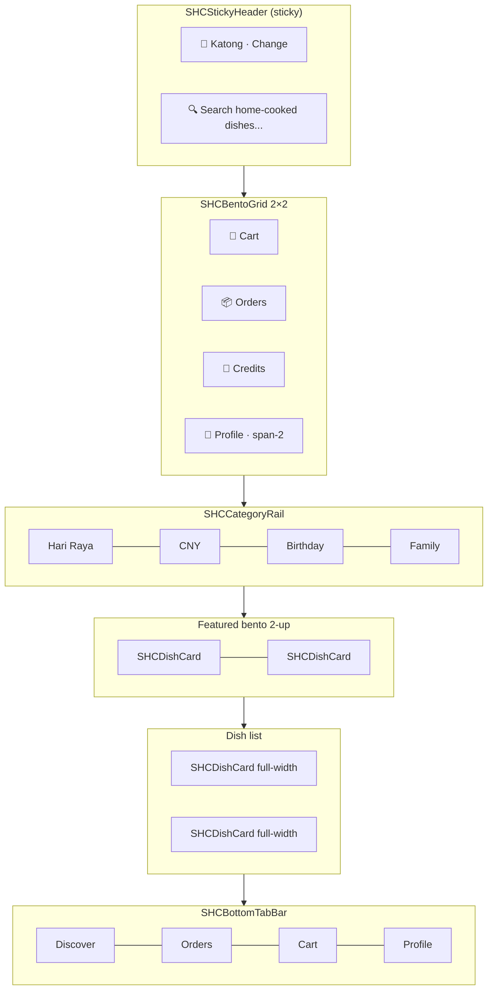

# Brand — Singapore Home Cooks

A heritage home-cooked food marketplace for planned occasions — verified HDB cooks, collection-only, PayNow checkout.

**Design system:** **Gourmeat** customer skin (Orbix Studio) + Neo-Brutalist cook app. Customer discover/checkout uses soft shadows, orange `#F87048`, floating dark nav.

_Last updated: 2026-06-19 — Gourmeat Behance implementation + tri-platform sync._

---

## Palette — Gourmeat Customer (Orbix Studio)

Reference: [Gourmeat Food APP UI/UX](https://www.behance.net/gallery/239040745/Gourmeat-Food-APP-UI-UX-Mobile-App-Orbix-Studio)

**Vibe:** premium minimal · warm orange · soft elevation · heritage-trust copy  
**Category:** consumer food delivery  
**Mood:** clean white cards on light gray, floating `#1C1C1C` bottom nav, black Pay Now CTAs

| Token | Hex | Role |
|---|---|---|
| `gourmeat-primary` | `#F87048` | Add buttons, discounts, active tab, prices |
| `gourmeat-nav` | `#1C1C1C` | Floating bottom tab bar |
| `gourmeat-pay` | `#1C1C1C` | Pay Now / checkout CTA |
| `gourmeat-bg` | `#FAFAFA` | Discover background |
| `gourmeat-surface` | `#FFFFFF` | Cards, search pill |
| `gourmeat-text` | `#1C1C1C` | Headlines (“Hungry? Order & Eat.”) |

**Components:** `packages/shc-ui/src/gourmeat.tsx` — headers, dish/cart/order rows, floating nav, pay CTAs

**Screens (Gourmeat):** customer discover · product PDP · cart · checkout · orders; cook dashboard · orders · listings · compliance · earnings; web parity on `/`, `/product`, `/cart`, `/orders`

---

## Palette — Legacy cook internals

Some shared form primitives (`ListingWizardStep`, allergen gates) still use brutal borders internally; screen chrome is Gourmeat on both apps.

### Core seeds

| Token | Hex | Role |
|---|---|---|
| `bg-base` | `#FFF8F0` | App background |
| `bg-elevated` | `#FFFFFF` | Cards, inputs, modals |
| `primary` | `#D96C4A` | CTAs, active chips, links, selected tabs |
| `primary-dark` | `#B84F32` | Pressed / hover primary |
| `accent` | `#FFB800` | Highlights, calorie chips, promos, allergen ack |
| `fg-base` | `#241812` | Body text + brutal borders |
| `fg-muted` | `#5C5144` | Secondary copy, metadata |
| `bento-mint` | `#E8F5E9` | Wallet, credits, success bento |
| `bento-peach` | `#FFE8DC` | Heritage, featured dishes |
| `bento-yellow` | `#FFF3C4` | Profile, promos, allergen surfaces |

### Semantic colors

| Token | Hex | Use |
|---|---|---|
| `success` | `#15803D` | Collected, paid, traffic-green |
| `warning` | `#CA8A04` | Pending, traffic-amber |
| `error` | `#B91C1C` | Validation, traffic-red |
| `heritage` | `#8B5E3C` | Cook stories, occasion copy |

### Brutalist rules

- **Borders:** 2px solid `#241812` on cards, buttons, inputs, chips, tab bar
- **Shadows:** hard offset only — `2px 2px 0` (sm) or `4px 4px 0` (default). No soft blur
- **Radius:** 8px inputs/chips; 12px cards; 999px pill chips
- **Typography weight:** 700–900 headings; 600+ labels; 500 body

### Token sources (must stay in sync)

| Platform | File |
|---|---|
| Mobile (both apps) | `packages/shc-ui/src/theme.ts` |
| Mobile components | `packages/shc-ui/src/primitives.tsx`, `domain.tsx` |
| Web | `apps/web/app/globals.css` |
| Web components | `apps/web/app/components/SHCWebComponents.tsx` |
| Food imagery (all platforms) | `packages/shc-utils/src/food-visuals.ts` |

### Food-app UX (dev.to + Weavers Web 2025 + Toptal)

References:
- [A guide to UI UX design for food delivery apps](https://dev.to/adamparker/a-guide-to-ui-ux-design-for-food-delivery-apps-513j) (Adam Parker / dev.to)
- [6 Essential UI/UX Design Principles for Food Delivery Apps in 2025](https://weaversweb.com/6-essential-ui-ux-design-principles-for-food-delivery-apps-in-2025/)

| dev.to principle | SHC implementation |
|---|---|
| Keep it simple | 3-tile bento (no cart duplicate); photo-led grids; minimal list copy |
| Eye-catching visuals | `SHCFoodImage` heroes; circular category rails; dish thumbnails on orders |
| Make ordering easy | `SHCDishOrderingInfo` (ingredients, allergens, calories); search ADD; sticky cart bar |
| Real-time updates | `SHCOrderTimeline` + 5–8s polling on active orders; `SHCActiveOrderBanner` on discover |
| Personalize | `useFavorites` + saved rail; “Order again”; “Because you loved…” subtitles |

| Principle | SHC implementation |
|---|---|
| 1. Simple UI | Photo-led 2-col grid, circular category rails, minimal copy on list screens |
| 2. Speed | `FlashList` + `recyclingKey` on `SHCFoodImage`; client-side filter cache; skeleton grids |
| 3. Delivery UX patterns | Search at top; **`SHCStickyCartBar`** docked above `SHCBottomTabBar` / `AppMobileTabBar` (Swiggy-style — never absolute inside scroll) |
| 4. Personalization | `SHCPersonalizedSectionHeader` / `PersonalizedSectionHeader`; “Order again” from `extractReorderDishes()`; location subtitle “Katong” |
| 5. Seamless onboarding | Guest browse — `SHCGuestBrowseBar` / `GuestBrowseBar`; sign in only at cart/checkout (`useGuestAuthGate`) |
| 6. Mobile + trust | `SHCTrustStrip` / `TrustStrip`; Trust & Safety page; allergen ack before checkout |

- **White space** — `shcSpacing.section` / `--shc-section-gap` between discover blocks; photos lead, UI stays quiet
- **Search + ADD** — `SHCSearchResultsPanel` / `SearchResultsDropdown`: thumbnail, price, add-to-cart without visiting PDP
- **Short journey** — `SHCCheckoutStepper`: Collection → Safety → PayNow (3 steps max)
- **Memorable story** — `SHCHeritageStoryBanner` local HDB cooks + trust link

### Visual-first rule (Swiggy / Zomato)

- **Photos > text** on every list and grid — dish cards are ~70% image with name/price overlay
- **Circular category rail** — 64px food photos, one-word labels (not text-only pills)
- **Bento tiles** — photo background + icon + one label (no sublabels or paragraphs)
- **2-column dish grid** on discover (FlashList mobile, CSS grid web)
- **PDP** — full-bleed hero food image; badges as chips; details collapsed/minimal

**Avoid:** heritage walls on list screens, emoji-only placeholders without photos, website-style copy blocks.

**Avoid:** old jade green `#1D9E75`, dev jargon, "demo"/"stub" in user-facing copy.

---

## Typography — DM Sans + DM Mono

| Role | Size | Weight | Use |
|---|---|---|---|
| Display | 28–32px | 800–900 | Hero titles, app name |
| H1 | 22–24px | 800 | Page title (PDP, Checkout) |
| H2 | 18px | 800 | Section breaks — bento row labels |
| H3 | 16px | 700 | Card titles, cook names |
| Body | 13–14px | 500 | Default copy |
| Caption | 11–12px | 500–600 | Metadata, disclaimers |
| Mono | 14–16px | 600 | Prices, order IDs, PayNow refs (`tabular-nums`) |

- **Display + body:** DM Sans (web via `next/font`; mobile system fallback until custom font wired)
- **Mono:** DM Mono for S$ amounts and references

---

## Motion principles

| Pattern | Library | Config / behaviour |
|---|---|---|
| Press feedback | Reanimated | `withSpring({ damping: 15, stiffness: 400 })` scale 0.97 on press |
| Tab / chip select | Reanimated | Spring border-color + background swap, 200ms |
| Screen enter | Moti | `fadeIn` + `translateY: 8 → 0`, duration 300ms |
| Sticky header | Reanimated | `useAnimatedScrollHandler` — shadow intensifies after 24px scroll |
| Bento cell tap | Reanimated | Hard shadow shrinks to `1px 1px` on press (pressed-in brutalist) |
| List items | FlashList | No layout animation on scroll; animate only on mount |

**Rule:** motion is snappy and physical — springs, never ease-in-out fades on primary CTAs.

---

## Component naming conventions

| Prefix | Scope | Example |
|---|---|---|
| `SHC` | All design-system exports | `SHCButton`, `SHCDishCard` |
| `shc` (camelCase) | Theme tokens | `shcColors`, `shcSpacing`, `shcShadows` |
| PascalCase + domain | Business components | `OrderCard`, `PayNowPanel`, `CollectionSlotPicker` |

**File placement:**

- `theme.ts` — colors, spacing, radii, borders, shadows, typography, motion constants
- `primitives.tsx` — layout shells, buttons, cards, rails, tab bar, sticky header
- `domain.tsx` — marketplace entities (dish, cook, order, PayNow, slots)
- `forms.tsx` — wizards, pickers, validation UI

**testID pattern:** `{screen}-{element}` — e.g. `discover-tab`, `dish-card-nasi-lemak`, `tab-bar-cart`.

---

## Layout wireframes

Food-delivery native patterns adapted for **collection-only** HDB marketplace.

### 1. Customer Discover



```
┌─────────────────────────────────────┐
│ 📍 Katong, Singapore        Change  │  ← SHCStickyHeader
│ ┌─────────────────────────────────┐ │
│ │ 🔍 Search home-cooked dishes... │ │
│ └─────────────────────────────────┘ │
├─────────────────────────────────────┤
│ ┌──────────┐ ┌──────────┐           │  ← SHCBentoGrid
│ │ 🛒 Cart  │ │ 📦 Orders│           │
│ └──────────┘ └──────────┘           │
│ ┌─────────────────────────────────┐ │
│ │ 🍃 Credits  ·  👤 Profile       │ │  span-2
│ └─────────────────────────────────┘ │
├─────────────────────────────────────┤
│ [Hari Raya] [CNY] [Birthday] [→]    │  ← SHCCategoryRail
├─────────────────────────────────────┤
│ Featured for your occasion          │
│ ┌────────────┐ ┌────────────┐       │  ← 2-up bento
│ │ Dish card  │ │ Dish card  │       │
│ └────────────┘ └────────────┘       │
│ ┌─────────────────────────────────┐ │
│ │ SHCDishCard (full list row)     │ │
│ └─────────────────────────────────┘ │
├─────────────────────────────────────┤
│ Discover │ Orders │ Cart │ Profile  │  ← SHCBottomTabBar
└─────────────────────────────────────┘
```

### 2. Dish PDP (Product Detail)

```
┌─────────────────────────────────────┐
│ ← Back                              │
│ ┌─────────────────────────────────┐ │
│ │                                 │ │
│ │     Hero image (4:3 stub)       │ │
│ │                                 │ │
│ └─────────────────────────────────┘ │
│ Nasi Lemak Sambal Prawn             │  H1
│ by Auntie Rose · Katong             │
│ S$12/portion · ★4.9 · ~420 cal     │
├─────────────────────────────────────┤
│ Heritage note (bento-peach card)    │
│ Tier-1 allergens + AllergenAck      │
│ Collection: Sat 28 Jun · 6–8pm     │  ← slot, not delivery ETA
├─────────────────────────────────────┤
│ ┌─────────────────────────────────┐ │  ← sticky bottom bar
│ │  [ − ]  2  [ + ]   Add S$24    │ │
│ └─────────────────────────────────┘ │
└─────────────────────────────────────┘
```

### 3. Cart / Checkout

```
┌─────────────────────────────────────┐
│ Checkout · S$48                     │
│ Cook: Auntie Rose · one-cook rule   │
├─────────────────────────────────────┤
│ CollectionSlotPicker                │
│ ┌─────────────────────────────────┐ │
│ │ ○ Sat 28 Jun · 6–8pm            │ │
│ │ ● Sun 29 Jun · 12–2pm  ✓       │ │
│ └─────────────────────────────────┘ │
├─────────────────────────────────────┤
│ AllergenAckCheckbox                 │
│ WalletCard / credits apply          │
├─────────────────────────────────────┤
│ PayNowPanel                         │
│ UEN · Amount · QR stub · ref input  │
│ [ I have paid via PayNow — Confirm ]│
└─────────────────────────────────────┘
```

### 4. Cook Dashboard

```
┌─────────────────────────────────────┐
│ Good morning, Auntie Rose           │
├─────────────────────────────────────┤
│ ┌────────────┐ ┌────────────┐       │  ← earnings bento
│ │ S$1,240    │ │ 4.9★       │       │
│ │ This week  │ │ 312 orders │       │
│ └────────────┘ └────────────┘       │
├─────────────────────────────────────┤
│ Quick actions (SHCBentoGrid)        │
│ ┌──────┐ ┌──────┐ ┌──────┐ ┌──────┐ │
│ │ List │ │ Cal  │ │ Board│ │ Chat │ │
│ └──────┘ └──────┘ └──────┘ └──────┘ │
├─────────────────────────────────────┤
│ Today's orders                      │
│ OrderCard × N                       │
│ [Accept] [Mark ready] [Complete]    │
└─────────────────────────────────────┘
```

---

## Tone and voice

Human, friendly, occasion-first. Describe cooks as real people — Auntie Rose, Katong heritage, HDB collection.

- **Do:** "Collect from Auntie Rose's kitchen in Katong", "Perfect for Hari Raya open house"
- **Don't:** "Vendor", "merchant portal", generic food-app filler

---

## Tri-platform sync rule

Any UI/brand/token change **must** update all of:

1. `brand.md`
2. `packages/shc-ui/src/theme.ts` (+ primitives/domain if components change)
3. `apps/web/app/globals.css` + `SHCWebComponents.tsx`
4. Both mobile apps if screen-level layout changes
5. `blueprint/12-shared-components/12-shared-components.md`
6. `blueprint/13-design-system/WIREFRAMES.md` (when layout changes)

See `.cursor/rules/tri-platform-ui-sync.mdc` and `.agents/skills/tri-platform-ui-sync/SKILL.md`.

---

## Mobile stack (target)

| Library | Role |
|---|---|
| TanStack Query | Server state |
| NativeWind | Tailwind on RN (planned) |
| Reanimated + Gesture Handler | Motion + gestures |
| FlashList | Performant lists |
| Moti + Skia | Micro-animations, badges |

Until NativeWind lands, use `@shc/ui` tokens exclusively — no hardcoded hex in screens.